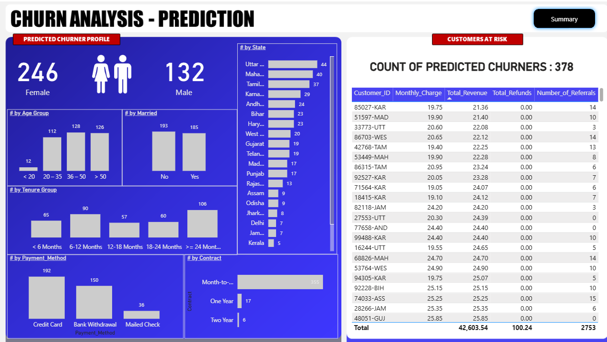

# 📊 End-to-End Customer Churn Analysis | SQL • Power BI • Python • Machine Learning

## 📌 Project Overview

I built this **End-to-End Customer Churn Analysis** project as part of my data analytics and machine learning portfolio.
The objective of this project is to analyze customer behavior, identify churn patterns, and predict potential churners using **SQL, Power BI dashboards, and a Random Forest Machine Learning model in Python**.

This project demonstrates my ability to work across the full analytics pipeline — from **data preparation and ETL** to **visual analytics** and **predictive modeling**.

---

## 🧰 Tools & Technologies Used

* SQL Server / SSMS
* Power BI
* Python (Pandas, NumPy, Scikit-learn)
* Jupyter Notebook
* Random Forest Classifier
* Data Visualization & Dashboard Design

---

## 🚀 Project Workflow

* Performed ETL and data exploration using SQL
* Built interactive dashboards in Power BI
* Created business metrics like churn rate, customer segmentation, and service analysis
* Developed a Machine Learning model to predict future churners
* Visualized predicted customers at risk

---

## 📊 Power BI Dashboard — Summary View

### Key Insights

* Total Customers, New Joiners, and Churn Rate overview
* Demographic and geographic churn analysis
* Contract, payment method, and tenure-based insights
* Service usage behavior and churn distribution

---

## 🤖 Power BI Dashboard — Churn Prediction View

### Prediction Features

* Random Forest model used to identify customers at risk
* Predicted churner profiles by age, gender, state, and tenure
* Customer risk table with revenue and payment metrics

---

## 📈 Machine Learning Model

* Algorithm Used: **Random Forest Classifier**
* Data preprocessing using label encoding
* Feature importance analysis
* Prediction generation for new customers

---

## 📂 Project Files

* `Churn_Analysis.ipynb` → Machine Learning workflow & model training
* Power BI Dashboard visuals
* Supporting project configuration files

---

## 🎯 Learning Outcomes

* Applied end-to-end analytics workflow
* Built interactive business dashboards
* Developed and evaluated a churn prediction model
* Translated raw data into actionable insights

---

## 👨‍💻 Author

**Amit kumar**
Aspiring Data Analyst | SQL • Power BI • Python • Machine Learning
